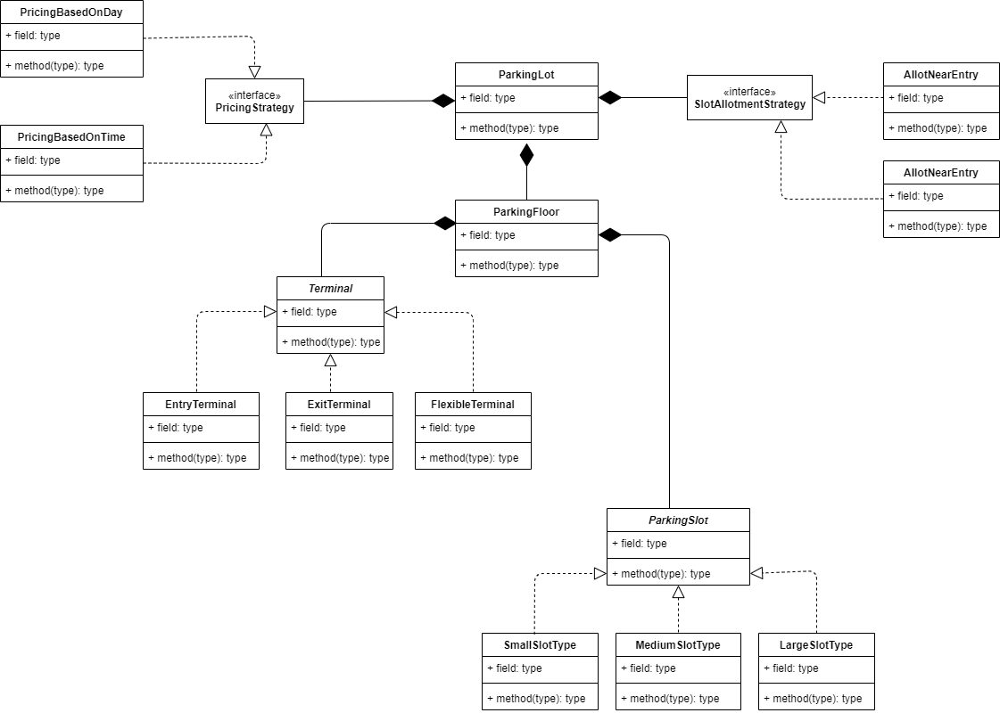

# Parking_Lot_LLD

Requirements
-------------

	1. When vehicle enters it should get a ticket with in-time and on exit payment should be made
	2. Multilevel parking should be supported i.e parking lot should have multiple floors
	3. Once parking lot is created modification of slots, entrance and exit shouldn't be allowed
	4. Multiple exits and entrance for each floor
	5. Categorize the parking slots as - small, medium, large
	6. Every slot has a base price. Base price depends on day of the week For eg - Base price on weekend will be more
	7. System supports various ways to allot slot For eg - allot slots nearest to entry or allot slots nearest to exit

Future Scope
-------------

	1. Calculate base price for slots add " Time of the day " factor.
	2. Vehicles can be assigned a slot based on availability but price calculation to be done based on type of slot. For eg - Small vehicle can be allotted a large slot, and price is calculated according to large slot base price.

Class Diagram
--------------

